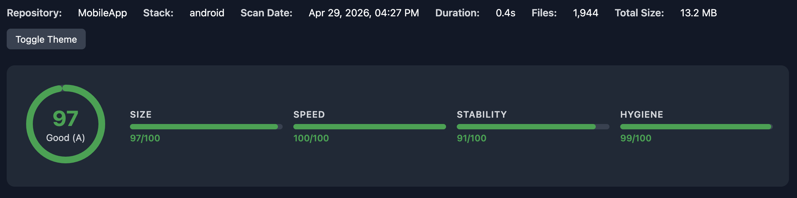
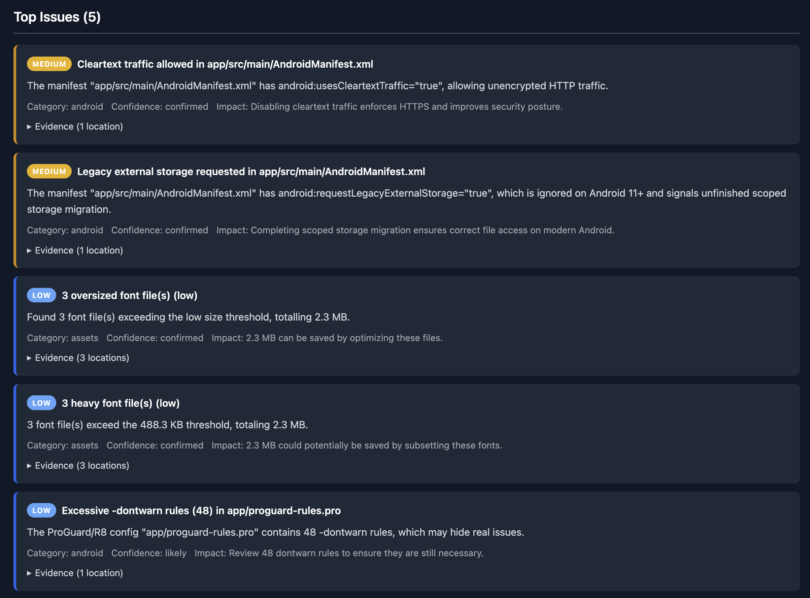
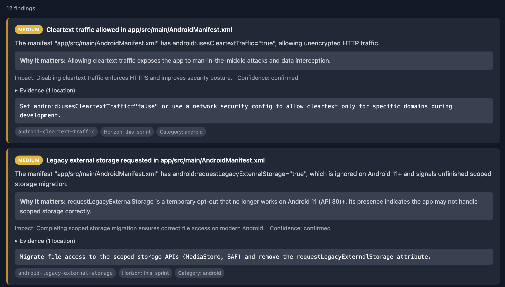

# Mobile Repo Doctor — GitHub Action

Automated health checks for Android, iOS, Flutter, and KMP repositories. Runs in your CI — code never leaves the runner.

## What you get

A standalone HTML report with a health score (0–100), severity-ranked findings, and actionable fixes — generated as a workflow artifact.



Top issues are sorted by severity with one-line summaries:



Each finding includes why it matters, impact, evidence (file paths, sizes), and a concrete fix:



## Usage

```yaml
- uses: Mavoryl/mobile-repo-doctor-action@v1
  with:
    scan-path: '.'
    fail-on: 'high'          # none | critical | high | score-below-70
    output: 'html,json'
```

### With Pro features

```yaml
- uses: Mavoryl/mobile-repo-doctor-action@v1
  with:
    api-key: ${{ secrets.REPO_DOCTOR_API_KEY }}
    fail-on: 'score-below-70'
```

## Inputs

| Input | Default | Description |
|-------|---------|-------------|
| `api-key` | `''` | API key for premium rules |
| `fail-on` | `none` | Failure policy: `none`, `critical`, `high`, `score-below-N` |
| `output` | `html,json` | Report formats |
| `scan-path` | `.` | Path to scan |
| `verbose` | `false` | Verbose output |
| `upload-artifacts` | `true` | Upload reports as artifacts |
| `artifact-name` | `repo-doctor-report` | Artifact name |

## Outputs

| Output | Description |
|--------|-------------|
| `score` | Health score (0-100) |
| `grade` | Grade (A-F) |
| `findings-count` | Total findings |
| `critical-count` | Critical findings |
| `high-count` | High findings |
| `exit-code` | Exit code after policy evaluation |

## Full example

```yaml
name: Repo Health Check
on: [push, pull_request]

jobs:
  health-check:
    runs-on: ubuntu-latest
    steps:
      - uses: actions/checkout@v4

      - uses: Mavoryl/mobile-repo-doctor-action@v1
        id: scan
        with:
          fail-on: 'high'

      - name: Check results
        if: always()
        run: |
          echo "Score: ${{ steps.scan.outputs.score }}/100 (${{ steps.scan.outputs.grade }})"
          echo "Findings: ${{ steps.scan.outputs.findings-count }}"
```

## What it checks

- **Size** — oversized assets, duplicates, heavy fonts & Lottie, WebP candidates, unoptimized PNGs
- **Speed** — dependency health, build config, optimization flags, kapt/ksp drift
- **Stability** — config drift, manifest anomalies, low SDK targets, platform hardening
- **Hygiene** — sensitive files, generated code, project structure, lockfile drift

71 checks total — 50 free, 21 in the Pro tier. Supports Android, iOS, Flutter, and KMP projects.

## Links

- [npm package](https://www.npmjs.com/package/mobile-repo-doctor) — install locally: `npm i -g mobile-repo-doctor`
